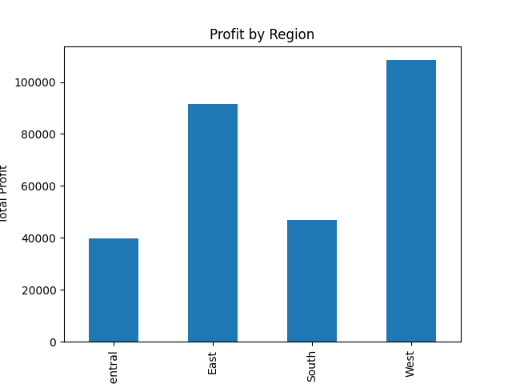
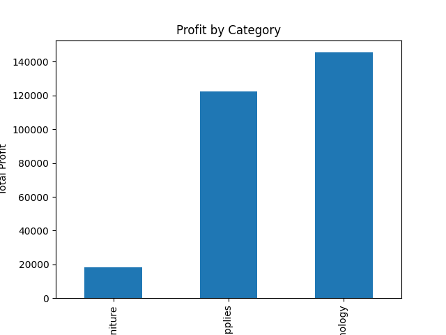
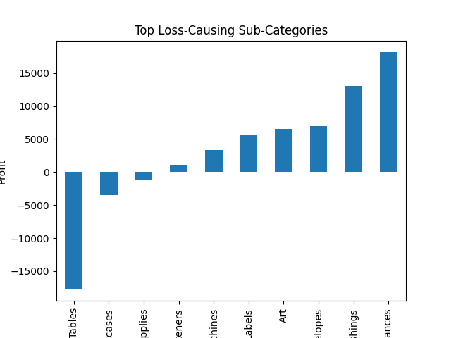
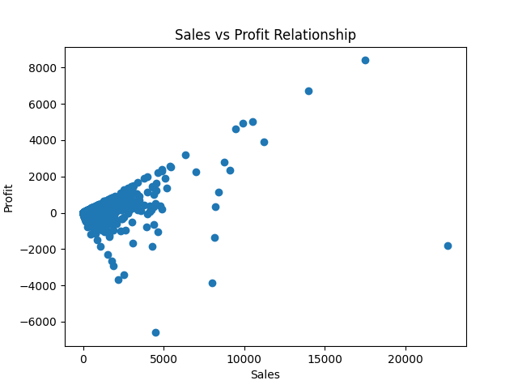
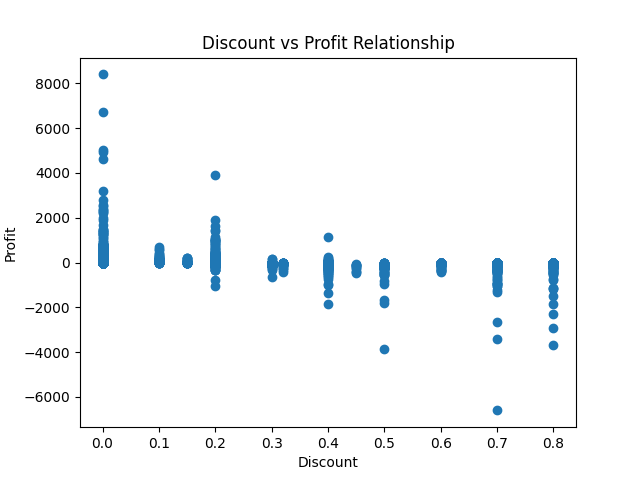
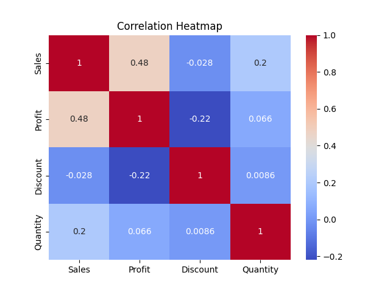

# Retail Sales Analysis – Superstore Dataset


[](https://nbviewer.org/github/VarshaNayak18/retail-sales-analysis/blob/main/notebooks/sales_analysis.ipynb)

## Quick Summary

- Analyzed ~10,000 retail transactions from the Superstore dataset.
- Explored sales performance across regions, categories, and time.
- Identified loss-making product segments and discount impact on profit.
- Built visualizations using Python (Pandas, Matplotlib, Seaborn).
- Performed additional analysis using SQL with SQLite.

## 📑 Table of Contents

- [Project Overview](#-project-overview)
- [Dataset](#-dataset)
- [Technologies Used](#-technologies-used)
- [SQL Analysis](#-sql-analysis)
- [Key Visualizations](#-key-analyses-and-visualizations)
- [Key Insights](#-key-insights)
- [Project Structure](#-project-structure)
- [How to Run the Project](#️-how-to-run-the-project)
- [Future Improvements](#-future-improvements)

## 📊 Project Overview

This project analyzes retail sales data using the Superstore dataset to uncover business insights related to sales performance, profitability, and product trends.

The analysis focuses on identifying:

* Sales performance across categories and regions
* Profitability of different product categories
* Impact of discounts on profit

## 📁 Dataset

Superstore Dataset (Kaggle)

https://www.kaggle.com/datasets/vivek468/superstore-dataset-final

## 🛠 Technologies Used

* Python
* Pandas
* Matplotlib
* Seaborn
* SQL (SQLite)
* Jupyter Notebook

## 🧠 SQL Analysis

The dataset was loaded into an SQLite database and analyzed using SQL queries to extract insights such as:

Total sales

Sales by category

Profit by region

Top performing sub-categories

## 📈 Key Analyses and Visualizations

* ### Sales by Category

      Analyzed total sales across product categories to identify top-performing segments.


* ### Profit Analysis

      Evaluated profitability across categories and regions.





* ### Loss-Causing Sub-Categories

      Identified product sub-categories generating negative profit.



* ### Sales vs Profit Relationship

      Investigated how sales volume relates to profitability.



* ### Discount Impact on Profit

      Analyzed how higher discounts affect profit margins.



* ### Correlation Analysis

      Used a heatmap to visualize relationships between numerical variables.



## 📊 Key Insights

* Technology category generates the highest overall sales and profit.
* Some sub-categories produce losses despite high sales.
* Higher discounts significantly reduce profitability.

## 📂 Project Structure

```
retail-sales-analysis
│
├── data
│ └── superstore.csv
│
├── images
│
├── notebooks
│ └── sales_analysis.ipynb
│
├── scripts
│ └── load_to_sqlite.py
│
├── sql
│ └── analysis_queries.sql
│
├── .gitignore
├── README.md
└── requirements.txt
```

## 🚀 How to Run the Project

1. Clone the repository

   git clone https://github.com/VarshaNayak18/retail-sales-analysis

2. Install dependencies

   pip install -r requirements.txt

3. Open the Jupyter notebook

   notebooks/sales_analysis.ipynb

4. Run all cells.

## 📌 Future Improvements

* Build an automated ETL pipeline
* Create an interactive dashboard using Power BI